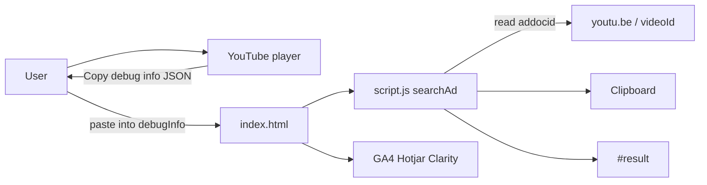

# Architecture

Status: active. Describes the system **as it runs today**. Planned work is in [roadmap.md](roadmap.md). When we leave static hosting, add an ADR under `docs/decisions/`.

## Context

AdGrabber helps people turn YouTube ad **debug info** (JSON copied from the YouTube player) into a shareable video URL. There is no account, no API of our own, and no server-side processing.

## Building blocks

| Piece | Role |
|-------|------|
| `index.html` | Markup, analytics snippets, inputs |
| `script.js` | `searchAd()`: `JSON.parse`, `debugData.addocid`, clipboard, `#result` |
| `styles.css` | Layout and visual style |
| `Assets/` | Logo, favicon, search icon, step PNGs used by the page |
| `CNAME` | Custom domain `www.adgrabber.in` |
| GitHub Pages | Hosts the repository **root** on `main` |

## Runtime behavior

1. User pastes a JSON string into `#debugInfo`.
2. `searchAd()` parses JSON and reads `addocid`.
3. On success it builds `https://youtu.be/${adVideoId}`, writes it to the clipboard, and renders a link in `#result`. Clipboard failure still shows the link.
4. Invalid JSON or missing `addocid` shows an error string in `#result`.
5. Success currently also uses `alert()`.

Nothing is persisted. Generated URLs never leave the browser except via the user’s clipboard or the analytics vendors (page usage, not ad-link content).

## Observability (today)

Third-party tags in `index.html` measure **page** usage (GA4, Hotjar, Clarity). They do not implement “which ad links did visitors generate.” That product goal needs a backend; see [roadmap.md](roadmap.md) and [security-privacy.md](security-privacy.md).

## Boundaries

- No backend, auth, or database.
- No feature flags or regional split. A push to `main` is 100% of traffic ([deployment.md](deployment.md)).
- `docs/`, `AGENTS.md`, `archive/`, and similar files are in the same Pages root. They are documentation or history, not app features.
- `design/` is a pointer to notes and archive; it is not a second UI.

## File map (runtime vs repo)

**Runtime (live site):** `index.html`, `script.js`, `styles.css`, `CNAME`, `Assets/*` referenced by HTML.

**Repo (agents and humans):** `README.md`, `AGENTS.md`, `CHANGELOG.md`, `LICENSE`, `docs/`, `design/`, `archive/`, `.cursor/rules/`, `.gitignore`.
