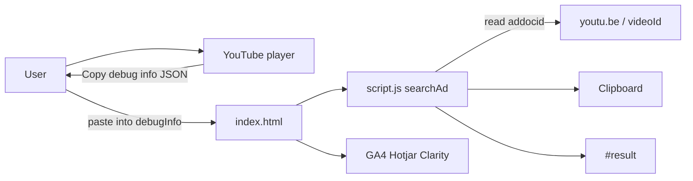
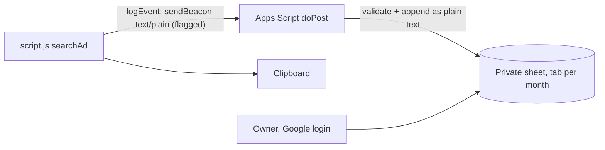

# Architecture

Status: active. Describes the system **as it runs today**. Planned work is in [roadmap.md](roadmap.md). When we leave static hosting, add an ADR under `docs/decisions/`.

## Context

AdGrabber helps people turn YouTube ad **debug info** (JSON copied from the YouTube player) into a shareable video URL. There is no account, no API of our own, and no server-side processing.

## Building blocks

| Piece | Role |
|-------|------|
| `index.html` | Markup, analytics snippets, inputs |
| `script.js` | `searchAd()`: `JSON.parse`, `debugData.addocid`, clipboard, `#result`; `logEvent()` flagged telemetry |
| `consent.js` | Consent Mode defaults before GA4/Clarity, Hotjar loader, EEA/UK/CH-only banner, footer "Privacy settings" |
| `privacy.html` | Privacy notice |
| `styles.css` | Layout and visual style |
| `Assets/` | Logo, favicon, search icon, step PNGs used by the page |
| `CNAME` | Custom domain `www.adgrabber.in` |
| GitHub Pages | Hosts the repository **root** on `main` |

## Runtime behavior

1. User pastes a JSON string into `#debugInfo`.
2. `searchAd()` parses JSON and reads `addocid`.
3. On success it builds `https://youtu.be/${adVideoId}`, writes it to the clipboard, and renders a link in `#result`. Clipboard failure still shows the link.
4. Invalid JSON or missing `addocid` shows an error string in `#result`.
5. Success currently also uses `alert()`.

Nothing is persisted while `TELEMETRY_ENABLED` is `false` (the default). When it is on, an anonymous event per Find goes to a private Google Sheet (see below). The pasted JSON never leaves the browser.

## Observability (today)

Third-party tags in `index.html` measure **page** usage (GA4, Hotjar, Clarity). They do not implement “which ad links did visitors generate.” That is handled by the flagged Sheets telemetry below; see [roadmap.md](roadmap.md) and [security-privacy.md](security-privacy.md).

### Usage telemetry (Google Sheets, flag off)

Chosen in [decisions/2026-10-01-google-sheets-telemetry.md](decisions/2026-10-01-google-sheets-telemetry.md). GitHub Pages keeps serving the site. `script.js` sends a small anonymous event to a Google Apps Script web app, which appends a row to a private Google Sheet owned by the owner's personal Google account. The sheet is the admin view.

Row columns: `timestamp_utc | ad_id | link | outcome | clipboard | time_zone`. `outcome` is `success`, `invalid_json`, or `missing_addocid`. `time_zone` is the browser's IANA zone (for example `Asia/Kolkata`) in place of a country.

Rules:

- `TELEMETRY_ENABLED` in `script.js` is the flag and kill switch. `TELEMETRY_URL` is the Apps Script `/exec` URL. It is public by design, since it can only write and never returns data.
- The beacon is fire-and-forget. If it fails or an adblocker blocks it, copying still works.
- The client sends only `outcome`, `ad_id`, `clipboard`, `tz`. Never the pasted JSON.
- Apps Script cannot see headers or IP, so it validates instead:
  - `ad_id` must match `^[A-Za-z0-9_-]{11}$`, and `outcome` must be one of the three values.
  - The body must be ≤ 512 bytes.
  - Values are written with plain-text format, which blocks formula injection such as `=IMPORTXML(...)`.
  - A global throttle allows about 300 writes a minute.
- The script has no `doGet`, uses `@OnlyCurrentDoc`, and lives in the Apps Script editor, not in this repo.
- Limits: 10M cells per spreadsheet and 30 simultaneous executions. Rotate tabs monthly and archive old years.
- Upgrade path if spam or volume outgrows Sheets: Cloudflare Worker + D1 behind Cloudflare Access. Only `TELEMETRY_URL` changes.

## Boundaries

- No backend, auth, or database of our own. The optional telemetry uses Google Apps Script + Sheets.
- No feature flags or regional split. A push to `main` is 100% of traffic ([deployment.md](deployment.md)).
- `docs/`, `AGENTS.md`, `archive/`, and similar files are in the same Pages root. They are documentation or history, not app features.
- `design/` is a pointer to notes and archive; it is not a second UI.

## File map (runtime vs repo)

**Runtime (live site):** `index.html`, `privacy.html`, `script.js`, `consent.js`, `styles.css`, `CNAME`, `Assets/*` referenced by HTML.

**Repo (agents and humans):** `README.md`, `AGENTS.md`, `CHANGELOG.md`, `LICENSE`, `docs/`, `design/`, `archive/`, `.cursor/rules/`, `.gitignore`.
