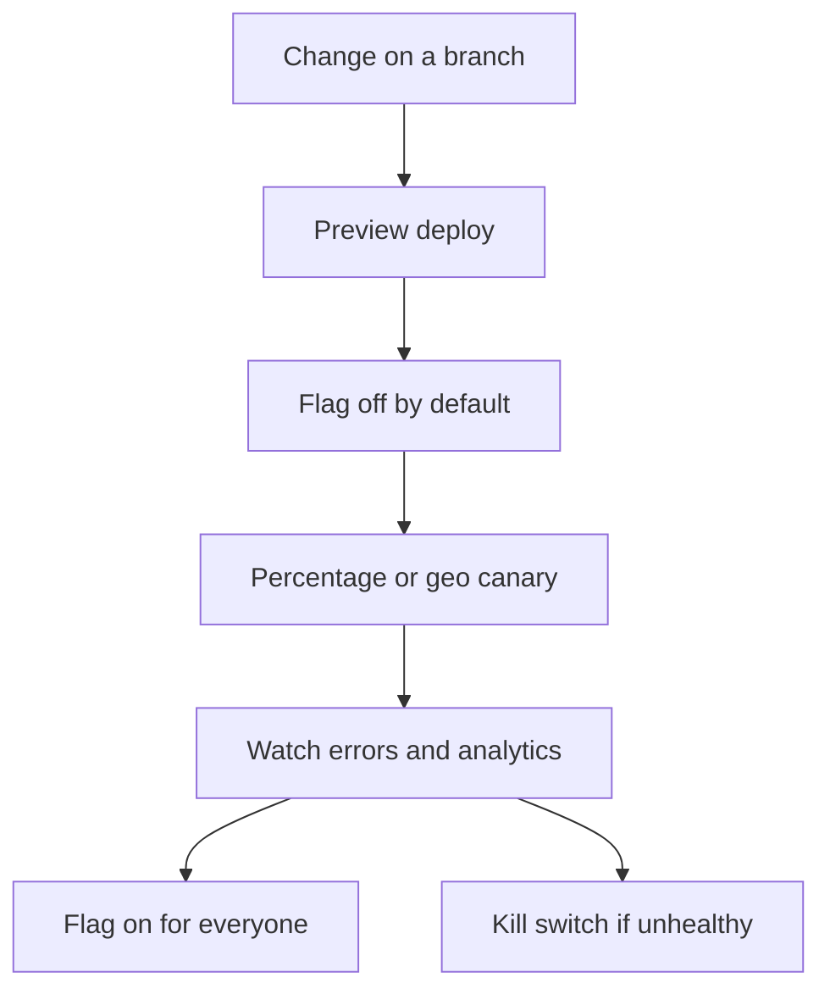

# Deployment

## Today

- Host: GitHub Pages from branch `main`, **site root = repository root**.
- Domain: `www.adgrabber.in` via `CNAME`.
- Rollout: every merge to `main` is **100% of users**. There is no preview environment, percentage flag, or geo split in this repo.

Verify a change by opening the live site (or local `index.html`) and running paste → Find → clipboard / `#result`.

## Target shape (not implemented)

Companies often ship to a small slice, watch reliability, then expand. GitHub Pages cannot do region-based canaries by itself. When we are asked to build this, aim for layers:

1. **Preview** — GitHub Actions (or a second Pages/Cloudflare project) deploys a non-production URL for internal testing.
2. **Percentage / cohort flags** — Remote config (JSON or edge) so the client enables new UI or telemetry only for a share of sessions. Include a **kill switch** that turns the new path off without reverting HTML.
3. **Geo canary** — CDN or edge (for example Cloudflare) in front of Pages, routing a country or continent to the new path. Record the vendor in `docs/decisions/`.
4. **100%** — Flag default on; remove dead code after it is stable.

New UI and any database writes must go through a flag. Do not rewrite `index.html` as an unflagged big bang.

## Relation to the database idea

Telemetry of generated video IDs is a **flagged** side effect, not part of the static-page happy path. Preview and a small cohort should run before any global logging. Details: [security-privacy.md](security-privacy.md), [roadmap.md](roadmap.md).
